# Migration Acceptance Research

### Business-level migration verification — bounded technical experiment + commercial falsification

**Independent research project · 2026**  
**Internal project label:** Prototype 1  
**Technical result:** `BOUNDED SYNTHETIC MECHANISM SURVIVED`  
**Commercial status:** `PARKED — SERVICES / INTERNAL-TOOL HYPOTHESIS PENDING FUTURE HUMAN VALIDATION`

> **In one sentence:** This project tested whether explicit business acceptance requirements could produce reusable, inspectable evidence across different synthetic migration representations — then asked whether that mechanism solved enough residual work to justify a standalone software product.

🌐 **Visual portfolio:** https://llkavya21.github.io/Migration-acceptance-research/

[2-minute case study](CASE_STUDY.md) · [Technical notes](TECHNICAL_NOTES.md) · [Commercial evidence](evidence/COMMERCIAL_EVIDENCE.md) · [Claim boundaries](CLAIM_BOUNDARIES.md)

---

## The problem

Migration tools can show that records moved, counts reconcile, IDs map or a technical transfer completed. But a business still cares about questions such as:

- Did the right person retain responsibility?
- Did approval history preserve the correct authority?
- Do permissions still match intended scope?
- Can required workflow actions still occur?
- Are status meanings and business relationships still correct?

The research question became:

> **Can reusable, explainable migration acceptance evidence reduce repeated validation work enough to support an independent product rather than an internal delivery method?**

## Research progression

```mermaid
flowchart LR
    A[Broad migration acceptance problem] --> B[Synthetic business requirements]
    B --> C[Alternative destination representations]
    C --> D[Technical mechanism survives bounded testing]
    D --> E[Commercial validation]
    E --> F[Jira Data Center → Cloud using JCMA]
    F --> G[Native tools + partners + UAT substitution attack]
    G --> H[PARKED pending human validation]
```

## Technical finding

The project defined 12 business acceptance requirements and preserved those requirement/rule families across alternative synthetic destination representations using representation-specific mappings and adapters.

Phase 3 reported:

- **12/12 business requirements reused unchanged**;
- **12/12 frozen rule families reused unchanged**;
- no identified in-scope false PASS or false FAIL under the recorded bounded adjudication;
- **one meaningful coverage gap (D-107)** where an incorrect project-accountability relationship passed because that relationship was outside the explicit frozen checks.

That last result matters: a PASS was never treated as universal migration correctness.

## Commercial finding

Public-source research narrowed the commercial scope to **specialist teams repeatedly delivering native Jira Data Center → Jira Cloud migrations using JCMA**.

Recurring acceptance work exists — expectations, evidence review, exceptions, retesting and sign-off — but substantial parts are already covered by:

- Atlassian migration tooling and reconciliation outputs;
- partner migration methodologies and UAT;
- configuration/integrity tools;
- test-management and evidence workflows;
- internal scripts and normal delivery methods.

The evidence did **not** establish a distinct standalone buyer, separate budget, material net labor savings or willingness to pay for another product layer.

## Final decision

**PARK.**

The best-supported interpretation is a possible **internal or partner delivery improvement**, pending future human validation of residual work and economics. No standalone MVP should be built on the current evidence.

## Authorship and AI assistance

This was an **AI-assisted research and implementation project directed by L. Kavya Nandini**. The user directed scope, approval gates, privacy constraints, evidence separation and result interpretation. AI assisted with research synthesis, deterministic implementation and experiment execution. The C review was AI-assisted rather than a human manual baseline. Do not interpret the repository as evidence that every line of implementation was personally hand-coded by the user.

## What this project demonstrates

`Business requirements` · `Experiment design` · `Evidence traceability` · `Product research` · `Commercial falsification` · `Migration workflows` · `Build-vs-buy analysis` · `Technical documentation` · `Decision discipline`

## Public vs private

This repository is intentionally curated. It excludes private author records, answer-bearing mutation ledgers, private evaluator material and other artifacts whose purpose was experimental separation rather than public portfolio review.

See [CLAIM_BOUNDARIES.md](CLAIM_BOUNDARIES.md) before using results outside this repository.
